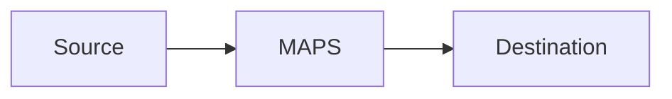

# maps-aggregator-config-engineer Artifact Fixture

Synthetic output used by smoke tests to verify output-contract coverage.

## Aggregation Requirement Mapping
Smoke placeholder for `Aggregation Requirement Mapping`.

## Window Model
Smoke placeholder for `Window Model`.

## Assumptions
Smoke placeholder for `Assumptions`.

## Deployable Config Entity
Smoke placeholder for `Deployable Config Entity`.

```bash
echo smoke-check
```

## Apply Steps
Smoke placeholder for `Apply Steps`.

```bash
echo smoke-check
```

## Verification Plan
Smoke placeholder for `Verification Plan`.

```bash
echo smoke-check
```

## Risk Notes
Smoke placeholder for `Risk Notes`.

## Scenario Metrics and Dashboard
Smoke placeholder for `Scenario Metrics and Dashboard`.

## C4 Architecture Diagram
Smoke placeholder for `C4 Architecture Diagram`.

## Absolute Path Example
`NetworkManager.yaml`

## Mermaid C4 Placeholder

