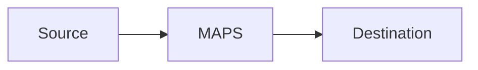

# maps-artifact-execution-smoke-harness Artifact Fixture

Synthetic output used by smoke tests to verify output-contract coverage.

## Smoke Scope
Smoke placeholder for `Smoke Scope`.

## Execution Plan
Smoke placeholder for `Execution Plan`.

## Applied Artifact Manifest
Smoke placeholder for `Applied Artifact Manifest`.

```bash
echo smoke-check
```

## Startup Evidence
Smoke placeholder for `Startup Evidence`.

## Listener Evidence
Smoke placeholder for `Listener Evidence`.

## Traffic Evidence
Smoke placeholder for `Traffic Evidence`.

## Failure Classification
Smoke placeholder for `Failure Classification`.

## Remediation and Re-run
Smoke placeholder for `Remediation and Re-run`.

## Teardown Evidence
Smoke placeholder for `Teardown Evidence`.

## Scenario Metrics and Dashboard
Smoke placeholder for `Scenario Metrics and Dashboard`.

## C4 Architecture Diagram
Smoke placeholder for `C4 Architecture Diagram`.

## Absolute Path Example
`NetworkManager.yaml`

## Mermaid C4 Placeholder

