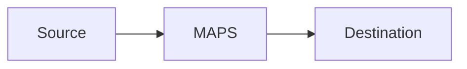

# maps-ml-stream-configurator Artifact Fixture

Synthetic output used by smoke tests to verify output-contract coverage.

## ML Stream Requirement Mapping
Smoke placeholder for `ML Stream Requirement Mapping`.

## Pipeline Shape
Smoke placeholder for `Pipeline Shape`.

## Model and Store Assumptions
Smoke placeholder for `Model and Store Assumptions`.

## Deployable Config Entity
Smoke placeholder for `Deployable Config Entity`.

```bash
echo smoke-check
```

## Apply Steps
Smoke placeholder for `Apply Steps`.

```bash
echo smoke-check
```

## Verification
Smoke placeholder for `Verification`.

```bash
echo smoke-check
```

## Risk and Complexity Notes
Smoke placeholder for `Risk and Complexity Notes`.

## Scenario Metrics and Dashboard
Smoke placeholder for `Scenario Metrics and Dashboard`.

## C4 Architecture Diagram
Smoke placeholder for `C4 Architecture Diagram`.

## Absolute Path Example
`NetworkManager.yaml`

## Mermaid C4 Placeholder

