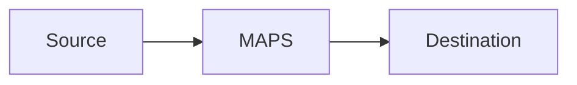

# maps-protocol-bridge-tester Artifact Fixture

Synthetic output used by smoke tests to verify output-contract coverage.

## Bridge Matrix
Smoke placeholder for `Bridge Matrix`.

## Preflight
Smoke placeholder for `Preflight`.

```bash
echo smoke-check
```

## Test Commands
Smoke placeholder for `Test Commands`.

```bash
echo smoke-check
```

## Results
Smoke placeholder for `Results`.

## Failure Classification
Smoke placeholder for `Failure Classification`.

## Remediation and Re-test
Smoke placeholder for `Remediation and Re-test`.

## Scenario Metrics and Dashboard
Smoke placeholder for `Scenario Metrics and Dashboard`.

## C4 Architecture Diagram
Smoke placeholder for `C4 Architecture Diagram`.

## Absolute Path Example
`/Users/krital/dev/starsense/mapsmessaging_server/NetworkManager.yaml`

## Mermaid C4 Placeholder

