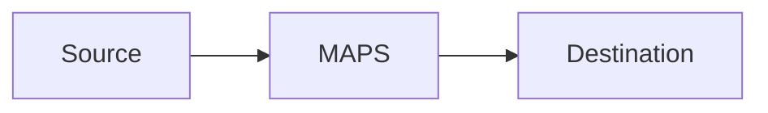

# maps-runtime-diagnostics Artifact Fixture

Synthetic output used by smoke tests to verify output-contract coverage.

## Observed Failure
Smoke placeholder for `Observed Failure`.

## Evidence
Smoke placeholder for `Evidence`.

## Root Cause
Smoke placeholder for `Root Cause`.

## Remediation
Smoke placeholder for `Remediation`.

## Post-Fix Verification
Smoke placeholder for `Post-Fix Verification`.

```bash
echo smoke-check
```

## Residual Risks
Smoke placeholder for `Residual Risks`.

## Scenario Metrics and Dashboard
Smoke placeholder for `Scenario Metrics and Dashboard`.

## C4 Architecture Diagram
Smoke placeholder for `C4 Architecture Diagram`.

## Absolute Path Example
`NetworkManager.yaml`

## Mermaid C4 Placeholder

