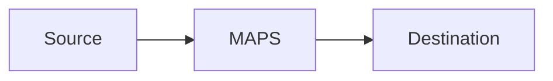

# maps-scenario-composer Artifact Fixture

Synthetic output used by smoke tests to verify output-contract coverage.

## Composition Matrix
Smoke placeholder for `Composition Matrix`.

## Unified Assumptions
Smoke placeholder for `Unified Assumptions`.

## Merged Deployable Entity
Smoke placeholder for `Merged Deployable Entity`.

```bash
echo smoke-check
```

## Unified Apply Sequence
Smoke placeholder for `Unified Apply Sequence`.

```bash
echo smoke-check
```

## Integrated Verification
Smoke placeholder for `Integrated Verification`.

```bash
echo smoke-check
```

## Failure Domain and Rollback
Smoke placeholder for `Failure Domain and Rollback`.

## Traceability Map
Smoke placeholder for `Traceability Map`.

## Scenario Metrics and Dashboard
Smoke placeholder for `Scenario Metrics and Dashboard`.

## C4 Architecture Diagram
Smoke placeholder for `C4 Architecture Diagram`.

## Absolute Path Example
`/Users/krital/dev/starsense/mapsmessaging_server/NetworkManager.yaml`

## Mermaid C4 Placeholder

