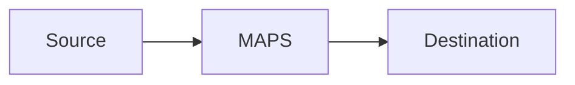

# maps-selector-rule-engineer Artifact Fixture

Synthetic output used by smoke tests to verify output-contract coverage.

## Selector Requirement Mapping
Smoke placeholder for `Selector Requirement Mapping`.

## Selector Evaluation Model
Smoke placeholder for `Selector Evaluation Model`.

## Assumptions
Smoke placeholder for `Assumptions`.

## Deployable Config Entity
Smoke placeholder for `Deployable Config Entity`.

```bash
echo smoke-check
```

## Apply Steps
Smoke placeholder for `Apply Steps`.

```bash
echo smoke-check
```

## Verification
Smoke placeholder for `Verification`.

```bash
echo smoke-check
```

## Performance and Risk Notes
Smoke placeholder for `Performance and Risk Notes`.

## Scenario Metrics and Dashboard
Smoke placeholder for `Scenario Metrics and Dashboard`.

## C4 Architecture Diagram
Smoke placeholder for `C4 Architecture Diagram`.

## Absolute Path Example
`/Users/krital/dev/starsense/mapsmessaging_server/NetworkManager.yaml`

## Mermaid C4 Placeholder

