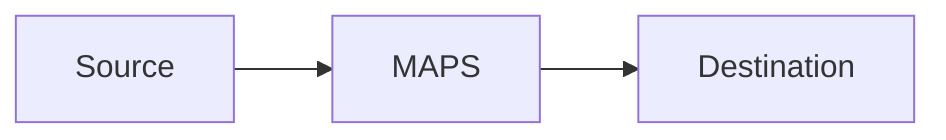

# maps-transform-chain-designer Artifact Fixture

Synthetic output used by smoke tests to verify output-contract coverage.

## Transformation Contract
Smoke placeholder for `Transformation Contract`.

## Ordered Stage Plan
Smoke placeholder for `Ordered Stage Plan`.

## Deployable Config Entity
Smoke placeholder for `Deployable Config Entity`.

```bash
echo smoke-check
```

## Apply Steps
Smoke placeholder for `Apply Steps`.

```bash
echo smoke-check
```

## Validation
Smoke placeholder for `Validation`.

## Runtime Verification
Smoke placeholder for `Runtime Verification`.

```bash
echo smoke-check
```

## Scenario Metrics and Dashboard
Smoke placeholder for `Scenario Metrics and Dashboard`.

## C4 Architecture Diagram
Smoke placeholder for `C4 Architecture Diagram`.

## Absolute Path Example
`/Users/krital/dev/starsense/mapsmessaging_server/NetworkManager.yaml`

## Mermaid C4 Placeholder

